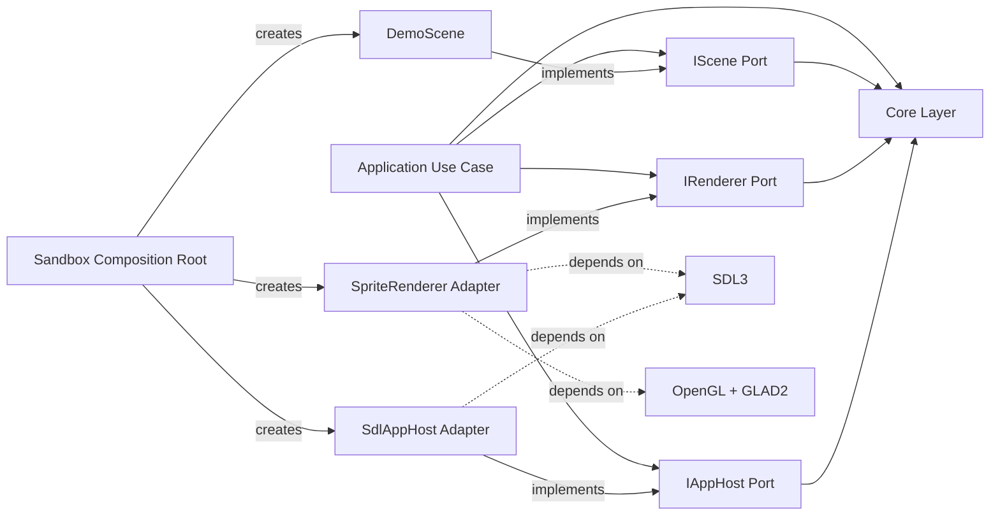
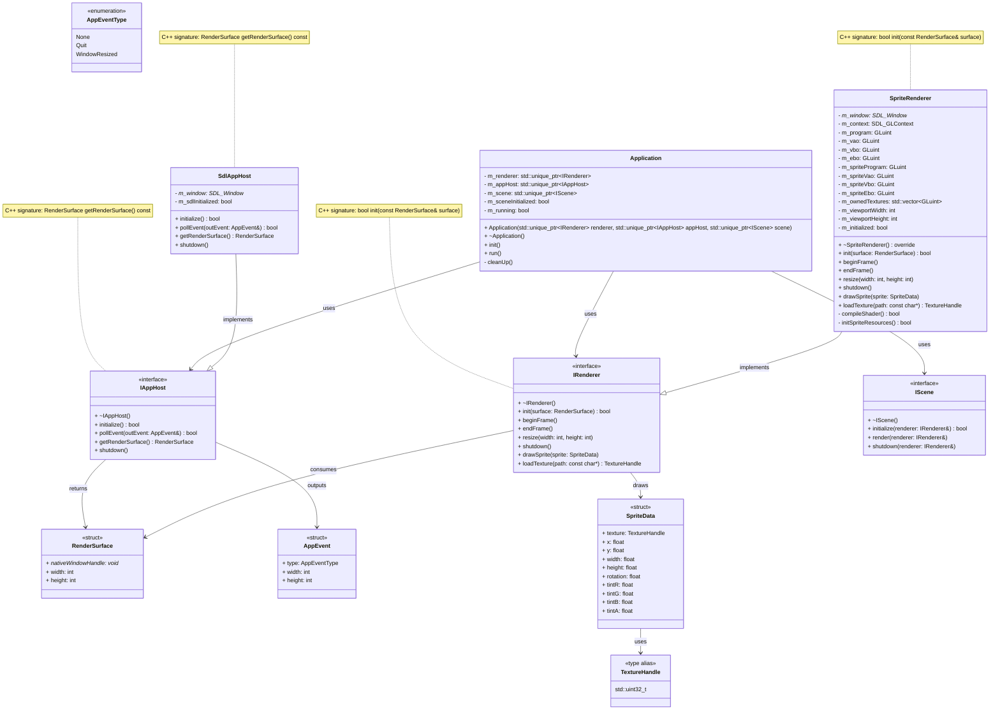
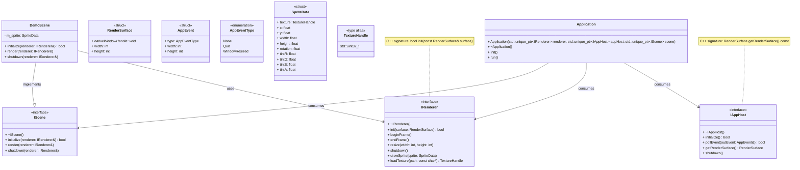

# NeoLab2D Engine Backend

2D engine backend in modern C++ with explicit Clean Architecture boundaries:

- Core layer defines application and rendering ports.
- Platform layer implements SDL3/OpenGL adapters.
- Sandbox is the composition root that wires adapters into core use cases.

## Status

- Core app loop is framework-agnostic (no SDL types in core APIs).
- Rendering contract is backend-agnostic via RenderSurface.
- SDL lifecycle/event/window concerns are isolated in SdlAppHost.
- OpenGL sprite rendering is isolated in platform SpriteRenderer.

## Tech

- C++26
- CMake + Ninja
- vcpkg (manifest mode)
- SDL3
- OpenGL 3.3 core + GLAD2

## Prerequisites

- Windows 10/11 (x64)
- CMake 3.20+
- Ninja 1.10+
- LLVM/Clang 17+ or MSVC 19.3x+
- Visual Studio 2022 Build Tools with Desktop C++ workload and Windows SDK
- vcpkg (manifest mode enabled)

Recommended install links:

- CMake: https://cmake.org/download/
- Ninja: https://github.com/ninja-build/ninja/releases
- LLVM: https://releases.llvm.org/
- Visual Studio Build Tools: https://visualstudio.microsoft.com/downloads/
- vcpkg: https://github.com/microsoft/vcpkg

## Layout

- engine/include/engine/core
  - Application
    - Application.h
    - AppEvent.h
    - IAppHost.h
    - IScene.h
  - Renderer
    - IRenderer.h
    - RenderSurface.h
    - Types.h
- engine/include/engine/platform
  - SdlAppHost.h
  - SpriteRenderer.h
- engine/src/core/Application
  - Application.cpp
- engine/src/platform
  - SdlAppHost.cpp
  - SpriteRenderer.cpp
  - StbImageImpl.cpp
- sandbox/src
  - main.cpp

## Build

```powershell
cmake --preset default
cmake --build --preset default
```

## Run

```powershell
.\build\sandbox\sandbox.exe
```

## Milestone Checklist

- [x] Window + fixed timestep loop
- [x] OpenGL renderer setup
- [x] Primitive rendering foundation (VAO/VBO, flexible geometry types)
- [ ] Sprite rendering and batching
- [ ] Input action mapping
- [ ] ECS integration (EnTT)
- [ ] Asset manager (load/cache/lifetime)
- [ ] Physics integration (Box2D)
- [ ] Animation system
- [ ] Camera system
- [ ] Audio system (miniaudio)
- [ ] Scene management
- [ ] Tilemap support
- [ ] Lua scripting (sol3)
- [ ] Editor UI (Dear ImGui)
- [ ] Save/load pipeline
- [ ] Debug and profiling tools

## Layer Rules

- Core can depend only on core abstractions and data types.
- Platform can depend on SDL/OpenGL and implement core interfaces.
- Sandbox composes concrete platform adapters with core use cases.

## Architecture Decisions

- Core ports are stable contracts: IRenderer, IAppHost, and IScene are defined in core so policies depend on interfaces, not frameworks.
- Framework lifecycle is isolated: SDL initialization, window creation, and event polling live only in SdlAppHost.
- Rendering backend is an adapter: SpriteRenderer is a platform implementation of IRenderer, not a core policy type.
- Composition happens at the edge: sandbox/main.cpp wires concrete adapters into Application.
- Data crossing boundaries is backend-agnostic: RenderSurface and AppEvent are plain core structs.
- Dependency direction is strictly inward: platform depends on core; core has no SDL/OpenGL includes.

## Dependency Direction




## Class UML

### Engine Library Classes



### Sandbox Composition Classes



## Notes

- Build outputs and CMake-generated files should not be committed.