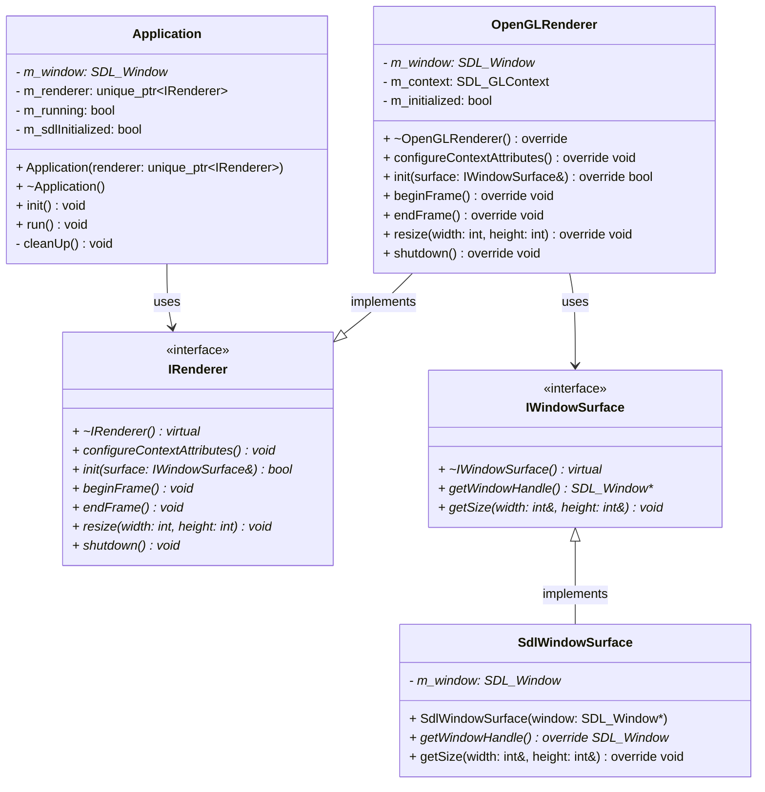

# NeoLab2D Engine Backend

A lightweight 2D engine backend in modern C++, currently focused on windowing, app lifecycle, and core architecture.

## Current Status

Implemented so far:
- SDL3-based application initialization and window creation
- Application lifecycle management with run loop and event polling
- OpenGL renderer with context management
- Interface-based renderer abstraction (IRenderer, IWindowSurface)
- Sandbox executable linked against engine static library
- CMake + vcpkg-based dependency setup

## Tech Stack

- Language: C++26
- Build system: CMake + Ninja
- Package manager: vcpkg (manifest mode)
- Windowing/input: SDL3

## Project Layout

- engine/: core engine static library
  - include/engine/
    - core/
      - Application/: Application lifecycle management
        - Application.h
      - Renderer/: Renderer abstractions
        - IRenderer.h
        - OpenGLRenderer.h
    - platform/: Platform-specific implementations
      - IWindowSurface.h
      - SdlWindowSurface.h
  - src/
    - core/
      - Application/: Application implementation
      - Renderer/: Renderer implementations
    - platform/: Platform implementations
      - SdlWindowSurface.cpp
- sandbox/: test executable that boots the engine
  - src/main.cpp
- CMakeLists.txt: root build entry
- CMakePresets.json: default configure/build preset
- vcpkg.json: dependency manifest

## Prerequisites

Install these tools:
- CMake 3.20+
- Ninja
- Clang (clang++)
- vcpkg at C:/vcpkg

The default preset uses:
- Generator: Ninja
- Compiler: clang++
- Toolchain: C:/vcpkg/scripts/buildsystems/vcpkg.cmake

## Build

From the repository root:

```powershell
cmake --preset default
cmake --build --preset default
```

## Run

```powershell
.\build\sandbox\sandbox.exe
```

## Development Roadmap

Recommended build order:

1. ✓ Window + fixed timestep loop
2. ✓ OpenGL renderer setup
3. Primitive and sprite rendering
4. Sprite batching
5. Input action mapping
6. ECS integration (EnTT)
7. Asset manager (load/cache/lifetime)
8. Physics integration (Box2D)
9. Animation system
10. Camera system
11. Audio system (miniaudio)
12. Scene management
13. Tilemap support
14. Lua scripting (sol3)
15. Editor UI (Dear ImGui)
16. Save/load pipeline
17. Debug and profiling tools

## Architecture

### Class Diagram



## Notes

- Build artifacts are intentionally ignored through .gitignore.
- CMake-generated files are local-environment outputs and should not be committed.

## License

No license has been set yet.
